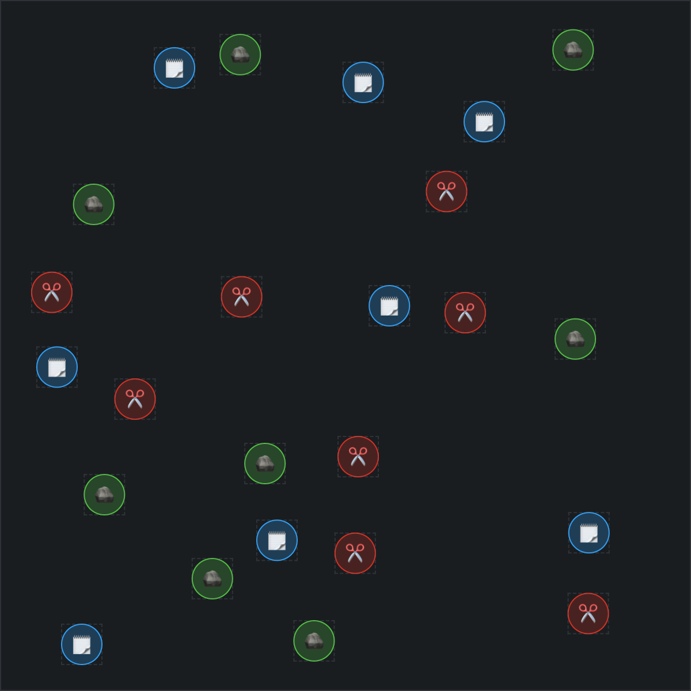

  <h1>Rock Paper Scissors</h1>
  
<strong>Game</strong> based on two-dimensional elastic collision created with <strong>Vanilla JS</strong>

  
<strong>Demo:</strong> <a href="https://mcktrjn.github.io/rock-paper-scissors">mcktrjn.github.io/rock-paper-scissors</a>

  

 

  
 Table of Contents

  <ul>
    <li><a href="#technologies">Technologies</a></li>
  </ul>

## Technologies

The following technologies were used in the project:

